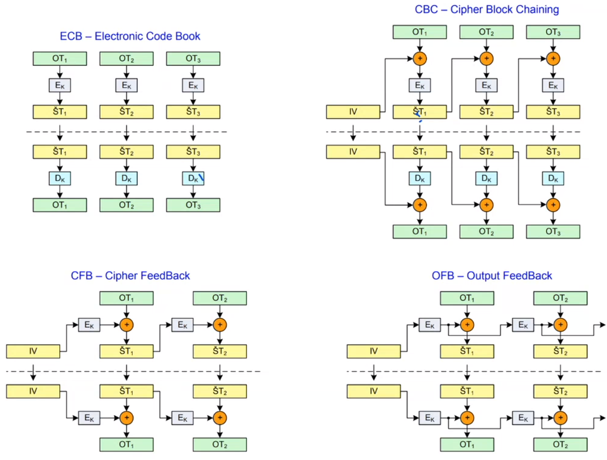
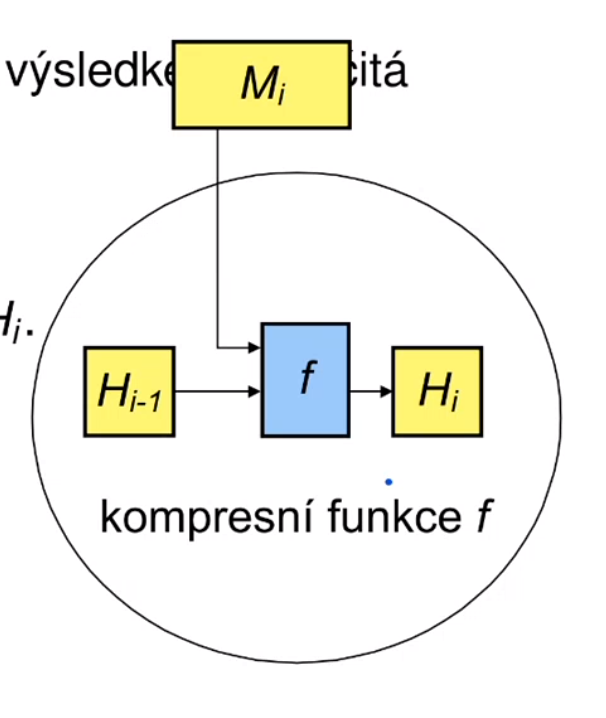
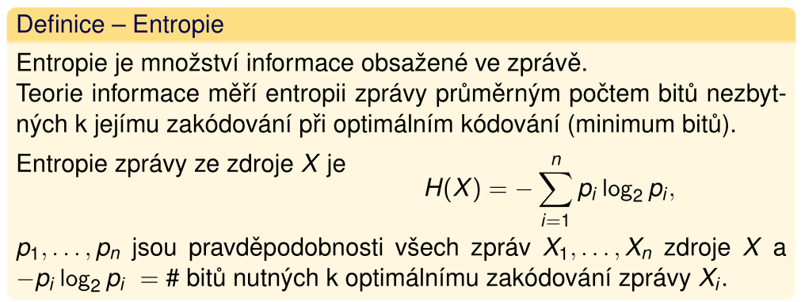

### Exponencialní
- symetrický systém
- *(2. 7/20)*
- po blocích o délce 2 \* s cifer
    - **m**: prvočíslo (čím větší, tím lepší)
    - **e**: klíč - **`gcd(e, m - 1) = 1`**
    - **d**: dešifrovací klíč = **inverze d** modulo **m - 1**
    - **s**: pocet znaků v bloku => kolikrát za sebou napíšu
    25 jako číslo aby < m. 25 je maximální hodnota pro znak angl. abecedy.
- šifrování: &nbsp;&nbsp;&nbsp;&nbsp; `c = p^e mod m`
- dešifrování:&nbsp; `p = c^d mod m`

### Zřízení společného klíče (Diffie-Hellman)
- **Malá Fermantova věta**
- asymetrický symetrický systém
- *(2. 12/20)*
    - **m**: nějaké velké prvočíslo
    - **a**: generátor multiplikativní grupy Z_m `0 < a < m`
    - **k_i**: **`gcd(k_i, m - 1) = 1`** náhodné číslo jako klíč pro itý subjekt `k_i < m - 1`
    - **y_i**: `a^(k_i) mod m` kde `0 < y_i < m`
- subjekty si prohodí y a pro sebe dopočítají K umocněním cizího y svým klíčem

### Diskrétní logaritmus
- pro multiplikativní grupu
    - příklad: `m = 17 g = 3` => `3^11 = 7 mod 17` => `log_3(7) = 11` 
- pro aditivní grupu
    - příklad: `m = 16 g = 3` => `3 * 8 = 7 mod 17` => `log_3(7) = 8`

## Proudové šifry
- zpracovávají jednotlivé znaky

### RC4
- *(3. )*
- zpusob inicializace permutace z klíče:
```
// S(i) je zpocatku identicka permutace
// S(0) = 0, S(1) = 1...
// k(x) je x. byte klíče (který je délky n)

for i in 0..256
{
    j = |j + S(i) + k(|i|n)|256
    vymen hodnoty S(i) a S(j)
}
```
- zpusob generovani hesla:
```
// h(index) je hodnota hesla na indexu
// S(i) je klic

i = 0
j = 0
for index in 0..n
{
    i = |i + 1|256
    j = |j + S(i)|256
    vymen mezi sebou hodnoty S(i) a S(j)
    h(index) = S(|S(i) + S(j)| 256)
}
```

### A5
- *(3. )*
- taktování
###**TODO**


## Blokové šifry
- zpracovávají bloky

### DES
- Feistelovský
- jediná nelineární část je S-Box (který je uvnitř funkce f)
    - bariéra proti provádění kryptoanalýzi
###**TODO**

### AES
- NENÍ Feistelovská!
- rychlá implementace na všech CPU, malé nároky na paměť
- paralerní zpracování
- iterativní! - počet rund se mění dle délky klíče
- 128-256 bit klic 10-14 rund
- polynomialní operace, jde paralerizovat (16 buňek)
- SubBytes nelinearita (substituční tabulka)
- ECB
    - nezávislý na jiných blocích
- CBC
    - závislý na jiných blocích
    - difůze
    - hodnota závislá na všech předchozích
- CFB
    - šifrovací funkcí se i dešifruje (úplně stejně)
    - podobně jako proudová
- OFB
    - šifrovací funkcí se i dešifruje (úplně stejně)
    - čistá proudová šifra 


## Hašovací funkce
- jednosměrné funkce:
    - 1\. typu
        - jednosměrnost složitostí operace a její inverze
        - př.: faktorizace
    - 2\. typu
        - př.: padací vrátka (např. klíč v asymetrické kryptografii)
- kolize
    - 1\. řádu
        - nenajdu dva vzory se stejným hashem
        - 50% pravděpodobnost = 2^(n/2) zpráv (n je počet bitů hashe)
    - 2\. řádu
        - nenajdu další vzor k danému hashi s daným vzorem
        - 50% pravděpodobnost = 2^(n) zpráv (n je počet bitů hashe)
- zarovnání zprávy- Damgard-Merklovo zesílení
    - Damgard-Merklovo zesílení
        - příklad na 512 bitových blocích
        - rozdělení zprávy na bloky po 512bitech
        - zpráva je doplňena 1 a x nulami, aby na konci zbylo 64bit volných
        - můžeme přidat i celý blok aby vyšlo
- Damgard-Merklův princip iterativní hashovací funkce
    - blok zprávy se zpracovává kompresní funkcí spolu s kontextem (zkompresovaný minulý blok nebo IV)
    

### SHA1
- ke zkoušce
    - vědět způsob rozložení zprávy na bloky
    - iteračně, prostupující kontext kompresní funkcí
    - 5x 32bit slova = 160bitů
    - blok se také dělí na 16x32bit slova (pro kompresní funkci) 

### Integritní kód HMAC
- připojen za zprávu
- bez znalosti klíče nelze spočítat -> nelze měnit zprávu a HMAC
- příjemce ví, že zpráva je validní, protože odesílatel musel znát klíč
- také lze sloužit pro prokázání znalosti klíče
###**TODO**

## Šifrování s veřejnými klíči

### RSA
- **Eulerova věta**
- **n**: modul, součin dvou prvočísel **p** a **q**
- **e**: exponent ```gcd(e, euler_totient(n)) = 1``` (jinak nelze vytvořit dešifrovací klíč))
    - doporučeno jako prvočíslo > p a q
- **d**: dešifrovací exponent (```inverze e v modulo euler_totient(n)```)
    - jen člověk, který zná rozklad na prvočísla -> spočítá eulerovu funkci
- šifrování: &nbsp;&nbsp;&nbsp;&nbsp; ```E(m) = c = |m^e|n, 0 < c < n```
- dešifrování: &nbsp;```D(c) = |c^d|n, 0 < c < n```

### Nalezení prvočísel
- potřebný počet testů = ```1/(2/log(10^pocet cifer))```

### Urychlení šifrování
- **e** s co nejmenší Hammingovo váhou

### Urychlení dešifrování
- RSA-CRT (RSA + ČVOZ)
- dešifrování ZKOUŠKA!!
###**TODO**

### El Gamal
- Diffie-Hellman distribuce klíčů
- c = |p*K| mod m
- p = |c*K^-1| mod m

## Teorie informace
- Vzdálenost jednoznačnosti: takový # bitů OT, jehož ŠT představuje jednoznačne původní OT (nelze dešifrovat na jiný)
    - delta_U = entropie(klíču)/D
- **E(X)**: Entropie zdroje zpráv X:
    - Kolik průměrně potřebujeme bitů pro zakódování náhodné zprávy vyslané zdrojem při optimálním kódování?
    - Kolik bitů musím vyluštit z ŠT abych určil OT?
    - 
- **R_N**: Obsažnost jazyka množiny všech zpráv délky N znaků.
    - Průměrná entropie na 1 znak - průměrný # bitů informace v 1 znaku ŠT
    - ```R_N = H(X)/N```
- **r**: Obsažnost jazyka vzhledem k jednomu znaku
    - ```r = lim n-> inf R_n```
    - kolik potřebuji bitů pro zakódování 1 písmena v daném jazyce
- **R**: Absolutní obsažnost jazyka (v bitech)
    - dosahuje ji jen generátor náhodných znaků
    - každý bit obsahuje informaci
- **D**: Redundance jazyka (jak moc jazyk plátvá bity)
    - ```D = R - r``` od maximální potenciální obsažnosti odečteme reálnou
    - Procentuálně ```100D/R``` bitů nadbytečných

## ECC
- asymetrické systémy
- příklady z 8. 11/27
- pozor na ZKOUŠKU
- **r** řád bodu - nejmenší r pro které je rP = O (opakuje se)
- **#E**: celkový počet bodů na křivce
- **kofaktor**: ```#E/r```
    - r je řád bodu P
    - má být co nejmenší
    - čím větší *r*, tím lepší
- komunikace
    - *P*: bod jehož řád je roven největšímu prvočíslu v rozkladu čísla #E nebo jeho násobku.
    - *k*: privátní klíč
    - *Q*: veřejný klíč
        - ```Q = kP```
    - předáme P, Q (veřejný klíč) a křivku
    - každá strana vezme veřejný klíč protistrany (bod) a sečte ho k-krát

## Kvantové šifrování
- obětování n bitů -> pravděpodobnost detekce odposlechu 1-(3/4)^n 

## ZDM opakování

### Kvadratické residuum
- číslo *a* je kv. residuum mod *m* pokud:
    - *m* je kladné číslo
    - ```gcd(a, m) = 1```
    - existuje x: ```x^2 = a (mod m)```
- v opačném případě číslo *a* je kv. **non**residuum mod *m*
- když je *a* kv. res. mod *p* => existují přesně 2 kořeny odmocniny výrazu ```x^2 mod p```
    - 1 . číslo *a* v intervalu (0, (p-2)/2)
    - 2 . číslo *-a mod p* v intervalu ((p-1)/2), p-1)

### Kv. residuum slož. modulu
- *n* = (p_1)^(alpha_1) * (p_2)^(alpha_2)...
- *a* je kv. res. n <=> je kv. residuem všech (p_i)^(alpha_i)

## PRNG
- Next-bit test: Je-li známo prvních k bitů náhodné posloupnosti,
neexistuje žádný algoritmus s polynomiální složitostí, který by
dokázal předpovědět (k + 1). bit s pravděpodobností úspěchu
vyšší než 1/2

- State compromise: I když je zjištěn vnitřní stav generátoru (ať
už celý nebo zčásti), nelze zpětně zrekonstruovat dosavadní
vygenerovanou náhodnou posloupnost. Navíc, pokud do
generátoru za běhu vstupuje další entropie, nemělo by být možné
ze znalosti vnitřního stavu předpovědět vnitřní stav v následujících
iteracích.

# TRNG
- statistické testy mohou pouze říct, že generátor je špatný, ne dobrý
- frekvenční test: posloupnost bitů statistika 1/0
- test hodnosti matic: testuje se lineární závislost náhodných vektorů 
- spektrární test: diskrétní Fourierova transformace, odhalí periodicitu
- Maurerův univerzální statistický test: nesmí dojít k velkému zmenšení po komprimaci

